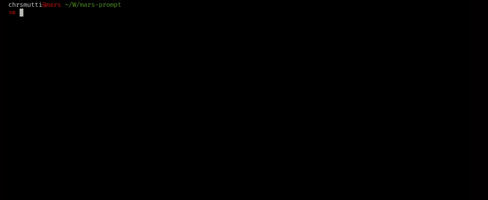

# mars-prompt

A simple [Fish shell][fish] prompt.

---

<div align="center">
  
</div>

---

## Features

- Simple and clean username, host and pwd display.
- Last command status code if non-zero.
- Intuitive git branch information.
- Current Node.js version, when package.json present in dir.
- Icons!

## Requirements

To get spacefish working correctly, you will need:

- [`fish`][fish]
- [`icons-in-terminal`](https://github.com/sebastiencs/icons-in-terminal) must be installed.

## Installation

### [Fisher](https://github.com/jorgebucaran/fisher)

```fish
$ fisher add chrsmutti/mars-prompt
```

<!-- Links -->

[fish]: https://fishshell.com
